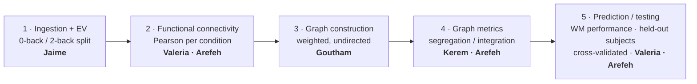

<div align="center">

# 🧠 The Gammas — HCP N-back Working-Memory Project

**Neuromatch Academy · CompNeuro 2026 · Pod Ifrit Ras el Hanout · Group 1**

[](https://compneuro.neuromatch.io/tutorials/intro.html)
[](https://compneuro.neuromatch.io/tutorials/Schedule/daily_schedules.html)
[-c62828)](data/README.md)
[](sandbox/jaime/02_eda_and_data_dictionary.ipynb)
[](https://docs.google.com/document/d/1mRC-UZhOGJ_ovPqXBudEBEPUyIp_AzjkJqvoIsAyouk/edit)
[](https://zoom.us/j/7944834775?pwd=M016NlExWm44ZDhRSEk0ZmROaURSZz09)

</div>

---

> ### 🎯 Working question
> Does functional connectivity **reconfigure** between low and high working-memory load
> (0-back → 2-back), and can that reconfiguration **predict** individual working-memory performance?
>
> *The Project TA's north star is **prediction on unseen subjects**. Functional connectivity and graph metrics are candidate **features**, not the goal — and the hypothesis stays falsifiable.*

**Status — 18 Jul:** the FC/prediction pilot is verified on `main`; the method and scientific story
remain under team review. On **Mon 20 Jul** we will align the open work and turn it into the sprint for
the final week (20–24 Jul). Personal exploration lives in `sandbox/`; only group-reviewed notebooks
move into `pipeline/`.

---

## 🔬 The pipeline

Five steps from raw BOLD to a tested prediction. This is the conceptual workflow; the table below
records what currently exists, not a fixed assignment for the final week.



| Stage | State | Lead(s) | Working location |
|---|---|---|---|
| 1 · Ingestion + EV segmentation | ✅ Done | Jaime | Shared A/B layer + [`pipeline/01`](pipeline/01_explore_dataset_b.ipynb) |
| 2 · Functional connectivity | 🟡 Prototype exists; review/generalise | Valeria · Arefeh | [Goutham on A](sandbox/goutham/per_analysis.ipynb) · [audited port to B](sandbox/jaime/04_goutham_pipeline_on_B.ipynb) |
| 3 · Matrices → graphs | ⚪ Not yet built as a shared stage | Goutham | Scope with the team on Monday |
| 4 · Graph metrics | 🟡 Exploratory only; full layer deferred | Kerem · Arefeh | Integration/modularity checks in [`04`](sandbox/jaime/04_goutham_pipeline_on_B.ipynb) |
| 5 · Prediction / testing | 🟡 Pilot verified; team review pending | Valeria · Arefeh | [B pilot](sandbox/jaime/04_goutham_pipeline_on_B.ipynb) · [B→A external validation](sandbox/jaime/05_dataset_A_external_validation.ipynb) |

> **Before duplicating work, share what you have.** Existing pilots are evidence, not yet the final
> group pipeline. On Monday the team will review the method, agree the MVP and assign the remaining
> work as a one-week sprint.

---

## ▶️ Start here

1. Read [AGENTS.md](AGENTS.md) — the working contract for agents and humans (setup, rules, style).
2. Read the [project plan](docs/project-plan.md) and the latest [meeting notes](docs/meetings/2026-07-17.md).
3. **Get the data.** Two cohorts sit behind one loader interface: the current MVP analysis runs on B
   (339 subjects; 336 analytic), while A (100 subjects) is used for external validation. See the
   [project plan](docs/project-plan.md) and [`data/README.md`](data/README.md).
4. Work inside your own `sandbox/<name>/` folder, starting from [`pipeline/00_NOTEBOOK_TEMPLATE.ipynb`](pipeline/00_NOTEBOOK_TEMPLATE.ipynb) — its setup cells wire the data path and import the shared A/B loader for you.
5. Read the short [contribution guide](CONTRIBUTING.md) before opening a PR.

---

## 🗂️ How the repo is organised

```text
pipeline/      group-reviewed notebooks; template + dataset-B onboarding EDA
sandbox/       iterative work, one folder per person
data/          local HCP data — gitignored except its README, never committed
docs/          the living project plan and dated meeting notes
manuscript/    abstract snapshots, references and prior work
```

- 🧪 **Still exploring?** Keep it in `sandbox/<name>/`.
- ✅ **Reviewed and useful to everyone?** Promote a clean explanatory copy to `pipeline/`.
- 💾 **Large or subject-level data?** Keep it out of Git and document how to reproduce it.

> For anything that could affect others' code, work on a **branch** and open a **pull request** so `main` stays stable. See [CONTRIBUTING.md](CONTRIBUTING.md).

---

## 👥 Team

Short working profiles, not fixed job descriptions — each member can update their own row.

| Member | Background / interest | Current focus |
|---|---|---|
| **Jaime** | Medical doctor + data scientist; Python, pipelines and data analysis | Method audit, external validation and abstract merge |
| **Pratik Bhandari** | *Profile to complete with Pratik* | Contribution to define |
| **Goutham Arcod** | HCP data exploration and initial proof of concept | Graph construction |
| **Valeria Moraga** | Functional connectivity and literature review | FC and prediction/testing |
| **Arefeh Lali Dehadhi** | Graph-theory framing and scientific writing | FC, graph metrics and testing |
| **Kerem Akyurt** | Previous graph-theory work in cognitive neuroscience | Graph metrics |

---

## 🔗 Key links

| Resource | Link |
|---|---|
| 🎥 Pod Zoom room | [Join](https://zoom.us/j/7944834775?pwd=M016NlExWm44ZDhRSEk0ZmROaURSZz09) |
| 📦 Group repository | [The-Gammas/The-Gammas](https://github.com/The-Gammas/The-Gammas) |
| 🤖 Agent & contributor guide | [AGENTS.md](AGENTS.md) · [CONTRIBUTING.md](CONTRIBUTING.md) |
| 🧪 Shared Colab (initial POC) | [Open in Colab](https://colab.research.google.com/drive/1Wu9Ke8bqr_UQp8_ZmtLTus-l0Xja3oIq) |
| ✍️ Live abstract | [Google Doc](https://docs.google.com/document/d/1mRC-UZhOGJ_ovPqXBudEBEPUyIp_AzjkJqvoIsAyouk/edit) |
| 📚 Official tutorials | [compneuro.neuromatch.io](https://compneuro.neuromatch.io/tutorials/intro.html) |
| 🗓️ Daily schedule (Slot 3) | [Daily schedules](https://compneuro.neuromatch.io/tutorials/Schedule/daily_schedules.html) |
| 🧭 Project guidance | [NMA project docs](https://compneuro.neuromatch.io/projects/docs/project_guidance.html) |
| 🧩 Project planner | [Planner app](https://nma-project-planner.vercel.app/) |
| 🧠 HCP fMRI dataset guide | [NMA fMRI projects](https://github.com/NeuromatchAcademy/course-content/tree/main/projects/fMRI) |

---

<details>
<summary><b>📓 Notebook style</b> (click to expand)</summary>

Notebooks should show the **reasoning**, not only the final code: explain the question, inputs,
sanity checks, processing, visualisations, interpretation, limitations and hand-off. Reusable or
repeated logic may live in a neighbouring `.py` file and be imported by the notebook.

</details>

<details>
<summary><b>⚙️ Setup</b> (click to expand)</summary>

### Google Colab
Open a notebook in Colab and run its setup cell to clone the repo and install requirements. **Note:**
cloning brings the *code* but not the HCP data (~1 GB for A, ~8 GB for B) — you still have to fetch the
data into the session (run the official loader notebook there, or mount Google Drive). See [`data/README.md`](data/README.md).

### Local
Requires a recent Python (`requirements.txt` is known-good on 3.12).
```bash
git clone https://github.com/The-Gammas/The-Gammas.git
cd The-Gammas
python3 -m venv .venv
source .venv/bin/activate  # Windows PowerShell: .venv\Scripts\Activate.ps1
pip install -r requirements.txt
jupyter lab
```
These steps install the code, **not** the data — see [`data/README.md`](data/README.md) to download it. By
default the loaders read from `./data`; set `GAMMAS_DATA_DIR` to point elsewhere
(e.g. `export GAMMAS_DATA_DIR=/path/to/hcp`).

</details>

---

## 💾 Data use

The NMA subset derives from the **Human Connectome Project**. Every user must follow the
[HCP Data Use Terms](https://www.humanconnectome.org/study/hcp-young-adult/document/wu-minn-hcp-consortium-open-access-data-use-terms).
Raw data and subject-level derived files are **not** versioned here; how to obtain, place and load it → [`data/README.md`](data/README.md).
