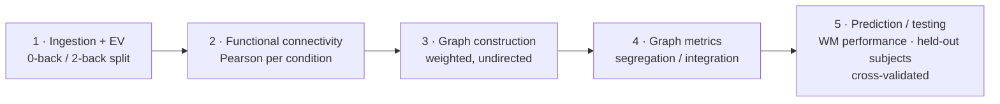

<div align="center">

# 🧠 The Gammas — HCP N-back Working-Memory Project

**Neuromatch Academy · CompNeuro 2026 · Pod Ifrit Ras el Hanout · Group 1**

[](https://compneuro.neuromatch.io/tutorials/intro.html)
[](docs/final-report.md)
[-c62828)](data/README.md)
[](docs/data-dictionary.md)
[](LICENSE)

</div>

---

> ### 🎯 Working question
> Does functional connectivity **reconfigure** between low and high working-memory load
> (0-back → 2-back), and can that reconfiguration **predict** individual working-memory performance?
>
> *The Project TA's north star was **prediction on unseen subjects**. Functional connectivity and graph
> metrics are candidate **features**, not the goal — and the hypothesis stayed falsifiable.*

## 📕 Read this first

**[`docs/final-report.md`](docs/final-report.md) — what was done, what was concluded, and where to
continue.** It is the source of truth for every result: a number quoted anywhere else without a
protocol, an `n` and a source cell is superseded by it. Everything dated before 24 Jul 2026 — the
submitted abstract, the minutes, the folder READMEs — is a record of what was known then.

The project closed at W3D5 (24 Jul 2026). In one paragraph: the 78-feature reconfiguration fingerprint
predicts 2-back accuracy in held-out participants (repeated-CV **r = +0.366 ± 0.024**, n = 336,
permutation p < 0.001) and transfers to the identity-disjoint cohort A (**r = +0.398**, 95% CI
[+0.25, +0.53]). The directional prediction was refined rather than confirmed: segregation drops under
load at group level (**Δ = −0.0236**, p = 3.45e-05) but a larger drop does not predict better
performance. A regional activation contrast predicts more strongly (0.600) under unmatched
representations, so connectivity specificity remains open.

---

## 🎤 The deliverable

The W3D5 project talk, exactly as presented on 24 July 2026.

| Artifact | What it is |
|---|---|
| 🖼️ **[The Gammas - NMA project.pdf](manuscript/slides/The%20Gammas%20-%20NMA%20project.pdf)** | The final deck. 11 pages: 6 spoken (cover/team · introduction · methods · results · robustness checks · conclusions) plus 5 backup slides opened only in Q&A. Self-contained — every figure embedded. |
| 🗣️ **[`presenter_guide_w3d5.md`](manuscript/slides/presenter_guide_w3d5.md)** | Per-slide presenter guide: concept definitions, how to read each figure and number, delivery scripts and likely Q&A. |
| 📄 **[`manuscript/abstract.md`](manuscript/abstract.md)** | The abstract as submitted on 20 Jul, plus the 21 Jul corrected draft. |

Every number on those slides traces to
[`pipeline/02_canonical_analysis_and_slides.ipynb`](pipeline/02_canonical_analysis_and_slides.ipynb).

---

## 📊 Evidence map: canonical result and source notebooks

The presentation evidence and figures are consolidated in one canonical notebook. The executed
sandbox notebooks remain the source record for each analysis and make the chronology auditable.

| Result | Number | Notebook |
|---|---|---|
| **Canonical presentation evidence** | FC prediction, B→A transfer, activation benchmark and segregation direction | [`pipeline/02_canonical_analysis_and_slides`](pipeline/02_canonical_analysis_and_slides.ipynb) |
| Reconfiguration predicts WM (canonical; reproduction gate for the rest) | r ≈ 0.366 repeated-CV, permutation p < 0.001 | [`04_goutham_pipeline_on_B`](sandbox/jaime/04_goutham_pipeline_on_B.ipynb) |
| Identity-disjoint B→A transfer within the same HCP study (train B-only, test held-out A) | r ≈ 0.398 | [`05_dataset_A_external_validation`](sandbox/jaime/05_dataset_A_external_validation.ipynb) |
| Tangent-space representation (method candidate) | POSTPONE ADOPTION | [`pipeline/03_method_benchmark_tangent_fc`](pipeline/03_method_benchmark_tangent_fc.ipynb) |
| **Robustness question:** activation predicts more strongly under unmatched representations; reconfiguration does not clearly add over 0-back FC | r ≈ 0.60 vs 0.37 | [`08_activation_vs_reconfiguration`](sandbox/jaime/08_activation_vs_reconfiguration.ipynb) |
| Goutham's pipeline reconciled on our data + brain maps | fingerprint 0.366; ΔSeg direction only (−0.024, not −0.048) | [`pipeline/04_goutham_pipeline_reconciliation`](pipeline/04_goutham_pipeline_reconciliation.ipynb) |

`pipeline/02` is the place to reproduce the final evidence path; `08` is the clearest place to audit
the post-submission comparison that changed the conclusion. Foundation (framing, ingestion, EDA,
A/B choice): notebooks 00-03. Full read-in-order guide:
[`sandbox/jaime/README.md`](sandbox/jaime/README.md).

---

## ▶️ Start here

The minimum path, four documents, about 40 minutes:

1. [`docs/final-report.md`](docs/final-report.md) — question, data, method, the canonical results table,
   limitations, open threads.
2. [The presented deck](manuscript/slides/The%20Gammas%20-%20NMA%20project.pdf) — the same story in 11 slides.
3. [`presenter_guide_w3d5.md`](manuscript/slides/presenter_guide_w3d5.md) — how each figure and number
   is meant to be read.
4. [`docs/data-dictionary.md`](docs/data-dictionary.md) — the single authority on files, variables and
   the two cohorts.

Then, depending on what you came for:

- **Re-run the analysis** → [`data/README.md`](data/README.md) to get the data, then `pipeline/01 → 02`.
  Full recipe in [final report §8](docs/final-report.md).
- **Reuse the code** → the [`gammas/`](gammas/) package and [`tests/`](tests/).
- **Contribute** → [AGENTS.md](AGENTS.md) (working contract) and [CONTRIBUTING.md](CONTRIBUTING.md)
  (where files go, branches, PRs).

---

## 🔬 The analysis in five steps


```mermaid
flowchart LR
    A["1 · Ingestion + EV<br/>0-back / 2-back split"]
    B["2 · Functional connectivity<br/>Pearson per condition"]
    C["3 · Graph construction<br/>weighted, undirected"]
    D["4 · Graph metrics<br/>segregation / integration"]
    E["5 · Prediction / testing<br/>WM performance · held-out subjects<br/>cross-validated"]
    A --> B --> C --> D --> E
```

Steps 1, 2 and 5 carry the canonical result; steps 3 and 4 entered it only as the segregation
direction and a descriptive network view — the full graph layer stayed exploratory and is listed as an
open thread in the [final report §10](docs/final-report.md). The stage-and-owner split agreed on
10 Jul is in the [meeting minutes](docs/meetings/2026-07-10.md); who actually contributed what is in
[final report §12](docs/final-report.md) and [AUTHORS.md](AUTHORS.md).

---

## 🗂️ How the repo is organised

```text
gammas/        shared A/B data layer: datasets → preprocessing → connectivity → evaluation
tests/         unit tests for the layer, no data required
pipeline/      group-reviewed notebooks: template, EDA, canonical evidence, two benchmarks
docs/          final report, data dictionary, meeting minutes, literature reviews, archive/
manuscript/    abstract, references, research proposal, the presented deck, archive/
sandbox/       per-person exploration, one folder per member — the audit trail
data/          local HCP data — gitignored except its README, never committed
```

Area indexes: [`docs/`](docs/README.md) · [`pipeline/`](pipeline/README.md) ·
[`manuscript/`](manuscript/README.md) · [`data/`](data/README.md) · [`sandbox/jaime/`](sandbox/jaime/README.md).

Rule of thumb: *if a teammate would read it to KNOW what happened, it goes in `docs/`; if they would
reuse it to WRITE a paper, it goes in `manuscript/`.* Full map with the source of truth for each fact:
[final report §9](docs/final-report.md).

> Shared areas (`pipeline/`, `docs/`, `gammas/`, `README.md`) change through a **branch + pull request**
> so `main` stays stable. See [CONTRIBUTING.md](CONTRIBUTING.md).

---

## 👥 Team

| Member | Background / interest |
|---|---|
| **Valeria Moraga** | Functional connectivity and literature review |
| **Kerem Akyurt** | Previous graph-theory work in cognitive neuroscience |
| **Goutham Arcod** | HCP data exploration and initial proof of concept |
| **Jaime Alonso Pineda Moreno** | Medical doctor + data scientist; Python, pipelines and data analysis |
| **Arefeh Lali Dehaghi** | Graph-theory framing and scientific writing |
| **Pratik Bhandari** | Pod member; by recorded decision, not an author |

Author order, CRediT roles and the evidence behind each: [AUTHORS.md](AUTHORS.md) and
[final report §12](docs/final-report.md). Commit history is not a proxy for contribution here —
several members delivered through shared documents, slides and meetings.

---

## 🔗 Key links

| Resource | Link |
|---|---|
| 📦 Group repository | [The-Gammas/The-Gammas](https://github.com/The-Gammas/The-Gammas) |
| 🤖 Agent & contributor guide | [AGENTS.md](AGENTS.md) · [CONTRIBUTING.md](CONTRIBUTING.md) |
| 📚 Official tutorials | [compneuro.neuromatch.io](https://compneuro.neuromatch.io/tutorials/intro.html) |
| 🧭 Project guidance | [NMA project docs](https://compneuro.neuromatch.io/projects/docs/project_guidance.html) |
| 🧠 HCP fMRI dataset guide | [NMA fMRI projects](https://github.com/NeuromatchAcademy/course-content/tree/main/projects/fMRI) |

---

<details>
<summary><b>📓 Notebook style</b> (click to expand)</summary>

Notebooks should show the **reasoning**, not only the final code: explain the question, inputs,
sanity checks, processing, visualisations, interpretation, limitations and hand-off. Reusable or
repeated logic belongs in the [`gammas/`](gammas/) package and is imported by the notebook.

</details>

<details>
<summary><b>⚙️ Setup</b> (click to expand)</summary>

### Google Colab
Open a notebook in Colab and run its setup cell to clone the repo and install requirements. **Note:**
cloning brings the *code* but not the HCP data (~1 GB for A, ~8 GB for B) — you still have to fetch the
data into the session (run the official loader notebook there, or mount Google Drive). See [`data/README.md`](data/README.md).

### Local
Requires a recent Python (`requirements.txt` is known-good on 3.12).
```bash
git clone https://github.com/The-Gammas/The-Gammas.git
cd The-Gammas
python3 -m venv .venv
source .venv/bin/activate  # Windows PowerShell: .venv\Scripts\Activate.ps1
pip install -r requirements.txt
python -m unittest discover -s tests   # sanity check, no data needed
jupyter lab
```
These steps install the code, **not** the data — see [`data/README.md`](data/README.md) to download it. By
default the loaders read from `./data`; set `GAMMAS_DATA_DIR` to point elsewhere
(e.g. `export GAMMAS_DATA_DIR=/path/to/hcp`).

Notebooks at any depth in the repo import the shared layer the same way:

```python
ROOT = next(p for p in (Path.cwd(), *Path.cwd().parents) if (p / "gammas").is_dir())
sys.path.insert(0, str(ROOT))
from gammas import datasets as ds, preprocessing as pp, evaluation as ev
```

</details>

---

## 💾 Data use

The NMA subset derives from the **Human Connectome Project**. Every user must follow the
[HCP Data Use Terms](https://www.humanconnectome.org/study/hcp-young-adult/document/wu-minn-hcp-consortium-open-access-data-use-terms).
Raw data and subject-level derived files are **not** versioned here; how to obtain, place and load it → [`data/README.md`](data/README.md).

## 📄 License and citation

Code (the `gammas/` package, `tests/` and notebook source) is released under the **MIT License**; text,
figures and documentation under **CC BY 4.0**. Both are in [LICENSE](LICENSE). If you reuse this work,
cite it with [CITATION.cff](CITATION.cff) and credit the authors listed in [AUTHORS.md](AUTHORS.md).
